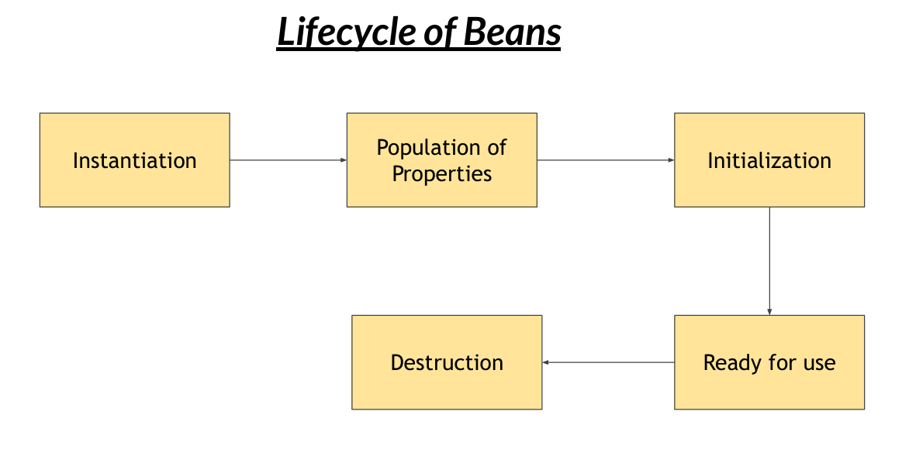
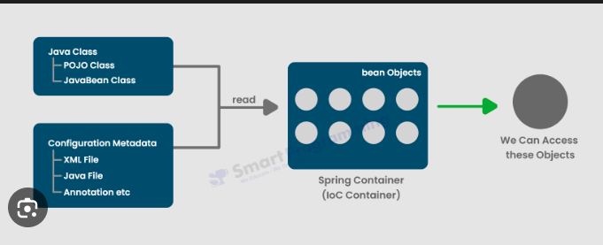

# Spring and Spring Boot Basics

Contains the learnings and implementation of **Spring** and **Spring Boot**

---
## 📌 Loose Coupling

- **Loose Coupling** is a design principle that aims to reduce the dependencies between components within a system.

## 📌 Inversion of Control (IOC)

- **Inversion of Control** is a design principle where the control of object creation and lifecycle management is transferred from the application code to an external container or framework.

## 📌 Dependency Injection (DI)

- **Dependency injection** is a design pattern commonly used in object-oriented programming, where the dependencies of a class are provided externally rather than being created within the class itself.
- Its aim is to achieve loose coupling b/w classes by removing the direct dependency instantiation from dependent class itself.

  ### Types of DI:
  - **Constructor Injection**
  - **Setter Injection**

- **<u>Constructor Injection</u>:**
  - Dependencies are provided to the dependent class through its constructor.
  - Dependencies are passed as arguments to the constructor when the dependent class is instantiated.
  - Constructor injection ensures that the dependencies are available when the object is created.

- **<u>Setter Injection</u>**
  - Dependencies are provided to the dependent class through setter methods
  - Dependent class exposes setter methods for each dependency that needs to be injected
  - Setter injection allows for flexibility as dependencies can be changed or updated after the object is instantiated

## 📌 Beans

- Objects that are managed by frameworks are called **Beans**.

  ### Bean Definition

- A bean definition includes configuration metadata that the container needs
  to know to create and manage the bean.

  ### Bean Configuration

- Bean definitions can be provided in various ways, including XML configuration files, annotations, and Java-based configuration.
- Beans are configured using XML files, where each bean is defined within <bean> tags with attributes specifying class, properties, and dependencies.
- Beans can be configured using annotations like @Component, @Service, @Repository, etc., which are scanned by Spring and managed as beans.

  ### Lifecycle of Beans
- **Instantiate** – Spring creates the object.
- **Inject** – Dependencies are injected.
- **Initialize** – @PostConstruct or init method runs.
- **Use** – Bean is used in the app.
- **Destroy** – @PreDestroy runs when context closes.
-  

  ### Dependency Resolution
- **Dependency Injection** - See above
- **Autowiring** 

## 📌 Spring Container
- **Spring Container** is the core part of Spring that creates, configures, and manages application objects (beans) and handles their dependency injection automatically.
- Two Types of Spring Containers:
  - Application Context
  - Bean Factory
    
- Configuration contains bean definition.

## 📌 Annotations
- **Annotations** in Java provide a way to add metadata to your code.
- **<u>Commonly Used Spring Annotations</u>:**
  - @Component
  - @Autowired
  - @Qualifier
  - @Value
  - @Repository
  - @Service
  - @Controller
  - @Request Mapping
  - @SpringBootApplication

## 📌 Components and Component Scan
- **Component** refers to a Java class that is managed by the Spring IoC container.
- There are two ways to define components in Java:
  - Using XML
  - Using Annotations
- ### <u>Using XML:</u>
        <bean id="myComponent" class="com.example.MyComponent" />

- ### <u>Using Annotations:</u>
        import org.springframework.stereotype.Component;
        @Component // Marks the class as a Spring component
        public class MyComponent {
          // Class implementation
        }

- **Component Scanning** is a feature which helps to automatically detect and register beans from predefined package paths.

---

## 👨‍💻 Author

Sanskar Shubham
